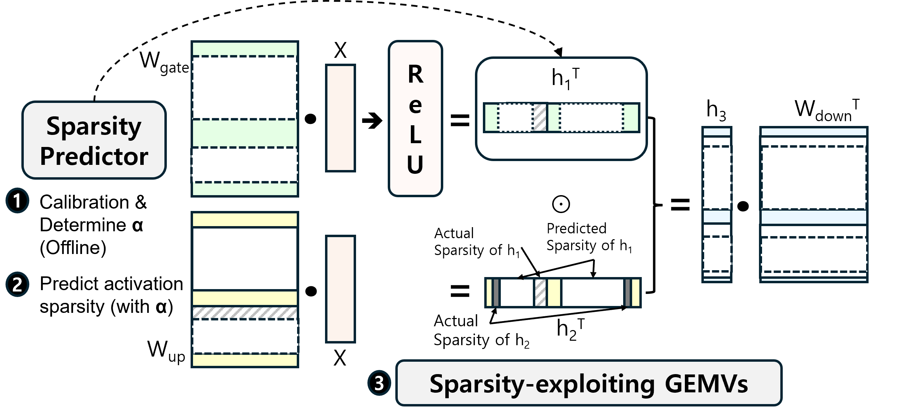

# SparseInfer: Training-free Prediction of Activation Sparsity for Fast LLM Inference
Fast LLM inference with low-overhead sparsity predictor and sparse kernels.



[](https://opensource.org/licenses/MIT)


## Abstract
Leveraging sparsity is crucial for optimizing large
language model (LLM) inference; however, modern LLMs employing SiLU as their activation function exhibit minimal activation sparsity. Recent research has proposed replacing SiLU
with ReLU to induce significant activation sparsity and showed
no downstream task accuracy degradation through fine-tuning.
However, taking full advantage of it required training a predictor
to estimate this sparsity. 

We introduce SparseInfer,
a simple, light-weight, and training-free predictor for activation
sparsity of ReLU-fied LLMs, in which activation sparsity is
predicted by comparing only the sign bits of inputs and weights. To
compensate for possible prediction inaccuracy, an adaptive tuning
of the predictor’s conservativeness is enabled, which can also serve
as a control knob for optimizing LLM inference. The proposed
method achieves approximately 21% faster inference speed over
the state-of-the-art, with negligible accuracy loss of within 1%p

## Installation

### Download
``` bash
git clone https://github.com/Sogang-aisys/Sparseinfer.git
cd Sparseinfer
```

### Build
``` bash
mkdir build
cd build
cmake .. -DLLAMA_CUDA=ON -DLLAMA_CUDA_MMV_Y=16
cmake --build . --config Release -j 10
```
-j : Number of CPUs for build

## Citation

If you find SparseInfer useful in your research or use this repository in your work, please consider citing our DATE 2025 paper:

```bibtex
@inproceedings{shin2025sparseinfer,
  title={{SparseInfer}: Training-free Prediction of Activation Sparsity for Fast {LLM} Inference},
  author={Shin, Jiho and Yang, Hoeseok and Yi, Youngmin},
  booktitle={2025 Design, Automation \& Test in Europe Conference (DATE)},
  pages={1--7},
  year={2025},
  publisher={IEEE},
  doi={10.23919/DATE64628.2025.10992997},
  url={https://doi.org/10.23919/DATE64628.2025.10992997}
}
```

## Contact

For questions or further information about SparseInfer, please contact:

- Jiho Shin
- Email: [sjh010529@kaist.ac.kr](mailto:sjh010529@kaist.ac.kr)
- GitHub: [simpack0513](https://github.com/simpack0513)
